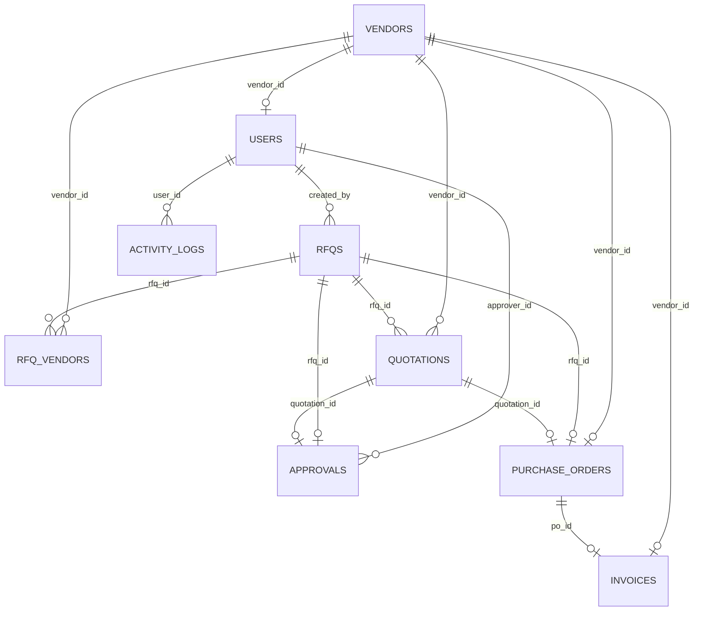

# Implementation Plan - PostgreSQL Backend Integration & Live Frontend Integration

This plan details the steps required to migrate the **VendorBridge** application from mock data to a fully workable ERP product backed by a PostgreSQL database.

## Goal
The application has 10 core modules that currently rely on synchronous mock data mutations in the frontend Redux store. We will build a clean, role-based backend with a PostgreSQL schema that matches the procurement relationships, define corresponding API routes, and integrate the frontend via Redux Thunks.

---

## User Review Required

> [!IMPORTANT]
> **Role Mapping Alignment**
> The database previously checked for lowercase roles (`admin`, `po`, `manager`, `vendor`), whereas the frontend pages and routing components require uppercase roles (`ADMIN`, `PROCUREMENT_OFFICER`, `MANAGER`, `VENDOR`). 
> We will unify the application roles to use the uppercase strings (`ADMIN`, `PROCUREMENT_OFFICER`, `MANAGER`, `VENDOR`) in both the PostgreSQL database constraint and the authentication middleware/Zod schemas.

---

## Proposed Database Schema (PostgreSQL)

We will drop and re-create the database tables in `backend/db/createTables.js` in the following dependency order:

1. **`vendors`**: Profile data for suppliers (GST, category, status, average rating, on-time percentage).
2. **`users`**: Auth credentials and profiles (links to a vendor via `vendor_id` if their role is `VENDOR`).
3. **`rfqs`**: Requests for quotation created by Procurement Officers.
4. **`rfq_vendors`**: Many-to-many junction table linking RFQs to assigned vendors.
5. **`quotations`**: Pricing and delivery quotes submitted by vendors.
6. **`approvals`**: Manager approval workflow tracking (Pending, Approved, Rejected).
7. **`purchase_orders`**: PO details generated automatically upon quote approval.
8. **`invoices`**: Billing documents generated from POs.
9. **`notifications`**: Targeted messages for users.
10. **`activity_logs`**: Audit trail logs.

---

## Proposed Changes

We will organize changes across the backend and frontend.

### 1. Database & Seeding [NEW]
* Create a database setup and seed file: [seed.js](file:///c:/Users/mukul/OneDrive/Desktop/Odoo-hackathon/VendorBridge-ODOO/backend/db/seed.js)
  * Includes the default demo users (`admin@vendorbridge.io`, `officer@vendorbridge.io`, `manager@vendorbridge.io`, `vendor@dell.com`, etc.) with properly hashed passwords so they can sign in immediately.
* Update [createTables.js](file:///c:/Users/mukul/OneDrive/Desktop/Odoo-hackathon/VendorBridge-ODOO/backend/db/createTables.js) to execute all DDL tables sequentially.

### 2. Backend Repositories & Controllers [NEW]
* Define query actions inside:
  * [vendor.repository.js](file:///c:/Users/mukul/OneDrive/Desktop/Odoo-hackathon/VendorBridge-ODOO/backend/repository/vendor.repository.js)
  * [rfq.repository.js](file:///c:/Users/mukul/OneDrive/Desktop/Odoo-hackathon/VendorBridge-ODOO/backend/repository/rfq.repository.js)
  * [quotation.repository.js](file:///c:/Users/mukul/OneDrive/Desktop/Odoo-hackathon/VendorBridge-ODOO/backend/repository/quotation.repository.js)
  * [approval.repository.js](file:///c:/Users/mukul/OneDrive/Desktop/Odoo-hackathon/VendorBridge-ODOO/backend/repository/approval.repository.js)
  * [po.repository.js](file:///c:/Users/mukul/OneDrive/Desktop/Odoo-hackathon/VendorBridge-ODOO/backend/repository/po.repository.js)
  * [invoice.repository.js](file:///c:/Users/mukul/OneDrive/Desktop/Odoo-hackathon/VendorBridge-ODOO/backend/repository/invoice.repository.js)
  * [notification.repository.js](file:///c:/Users/mukul/OneDrive/Desktop/Odoo-hackathon/VendorBridge-ODOO/backend/repository/notification.repository.js)
  * [activity.repository.js](file:///c:/Users/mukul/OneDrive/Desktop/Odoo-hackathon/VendorBridge-ODOO/backend/repository/activity.repository.js)
  * [admin.repository.js](file:///c:/Users/mukul/OneDrive/Desktop/Odoo-hackathon/VendorBridge-ODOO/backend/repository/admin.repository.js)
* Implement controllers for each module to translate HTTP requests to repository queries and return descriptive JSON responses.

### 3. Backend Routes & Mounting [MODIFY]
* Wire all routers in the `backend/routes` folder:
  * [vendor.routes.js](file:///c:/Users/mukul/OneDrive/Desktop/Odoo-hackathon/VendorBridge-ODOO/backend/routes/vendor.routes.js)
  * [rfq.routes.js](file:///c:/Users/mukul/OneDrive/Desktop/Odoo-hackathon/VendorBridge-ODOO/backend/routes/rfq.routes.js)
  * [quotation.routes.js](file:///c:/Users/mukul/OneDrive/Desktop/Odoo-hackathon/VendorBridge-ODOO/backend/routes/quotation.routes.js)
  * [approval.routes.js](file:///c:/Users/mukul/OneDrive/Desktop/Odoo-hackathon/VendorBridge-ODOO/backend/routes/approval.routes.js)
  * [po.routes.js](file:///c:/Users/mukul/OneDrive/Desktop/Odoo-hackathon/VendorBridge-ODOO/backend/routes/po.routes.js)
  * [invoice.routes.js](file:///c:/Users/mukul/OneDrive/Desktop/Odoo-hackathon/VendorBridge-ODOO/backend/routes/invoice.routes.js)
  * [notification.routes.js](file:///c:/Users/mukul/OneDrive/Desktop/Odoo-hackathon/VendorBridge-ODOO/backend/routes/notification.routes.js)
  * [activity.routes.js](file:///c:/Users/mukul/OneDrive/Desktop/Odoo-hackathon/VendorBridge-ODOO/backend/routes/activity.routes.js)
  * [user.routes.js](file:///c:/Users/mukul/OneDrive/Desktop/Odoo-hackathon/VendorBridge-ODOO/backend/routes/user.routes.js)
* Update [app.js](file:///c:/Users/mukul/OneDrive/Desktop/Odoo-hackathon/VendorBridge-ODOO/backend/app.js) to mount the new routes under `/api/...` and fix the auth path naming to mount at `/api/auth` (and keeping alias `/api/user` for safety).
* Fix the commented out user fetch block in [auth.js](file:///c:/Users/mukul/OneDrive/Desktop/Odoo-hackathon/VendorBridge-ODOO/backend/middlewares/auth.js) to look up the user using `findUserById` in Postgres.
* Update [auth.validation.js](file:///c:/Users/mukul/OneDrive/Desktop/Odoo-hackathon/VendorBridge-ODOO/backend/validations/auth.validation.js) to validate roles as `ADMIN`, `PROCUREMENT_OFFICER`, `MANAGER`, `VENDOR`.

### 4. Frontend API Integrations [MODIFY]
* Fix relative imports and route definitions in [authActions.ts](file:///c:/Users/mukul/OneDrive/Desktop/Odoo-hackathon/VendorBridge-ODOO/frontend/src/store/actions/authActions.ts) and [authSlice.ts](file:///c:/Users/mukul/OneDrive/Desktop/Odoo-hackathon/VendorBridge-ODOO/frontend/src/store/slices/authSlice.ts) (including aliasing `logoutUser` to `logout` to prevent compilation errors).
* Create Redux thunk action files for other slices:
  * [vendorActions.ts](file:///c:/Users/mukul/OneDrive/Desktop/Odoo-hackathon/VendorBridge-ODOO/frontend/src/store/actions/vendorActions.ts)
  * [rfqActions.ts](file:///c:/Users/mukul/OneDrive/Desktop/Odoo-hackathon/VendorBridge-ODOO/frontend/src/store/actions/rfqActions.ts)
  * [quotationActions.ts](file:///c:/Users/mukul/OneDrive/Desktop/Odoo-hackathon/VendorBridge-ODOO/frontend/src/store/actions/quotationActions.ts)
  * [approvalActions.ts](file:///c:/Users/mukul/OneDrive/Desktop/Odoo-hackathon/VendorBridge-ODOO/frontend/src/store/actions/approvalActions.ts)
  * [poActions.ts](file:///c:/Users/mukul/OneDrive/Desktop/Odoo-hackathon/VendorBridge-ODOO/frontend/src/store/actions/poActions.ts)
  * [invoiceActions.ts](file:///c:/Users/mukul/OneDrive/Desktop/Odoo-hackathon/VendorBridge-ODOO/frontend/src/store/actions/invoiceActions.ts)
  * [notificationActions.ts](file:///c:/Users/mukul/OneDrive/Desktop/Odoo-hackathon/VendorBridge-ODOO/frontend/src/store/actions/notificationActions.ts)
  * [activityActions.ts](file:///c:/Users/mukul/OneDrive/Desktop/Odoo-hackathon/VendorBridge-ODOO/frontend/src/store/actions/activityActions.ts)
  * [userActions.ts](file:///c:/Users/mukul/OneDrive/Desktop/Odoo-hackathon/VendorBridge-ODOO/frontend/src/store/actions/userActions.ts)
* Update corresponding slices (e.g. `vendorsSlice.ts`, `rfqsSlice.ts`, `invoicesSlice.ts`, etc.) to handle these async actions (fetch lists, dispatch updates) and store the server-fetched lists instead of static seed arrays.
* In [Layout.tsx](file:///c:/Users/mukul/OneDrive/Desktop/Odoo-hackathon/VendorBridge-ODOO/frontend/src/components/Layout.tsx) or [Dashboard.tsx](file:///c:/Users/mukul/OneDrive/Desktop/Odoo-hackathon/VendorBridge-ODOO/frontend/src/pages/Dashboard.tsx), load all initial data upon user login to populate the local state.

---

## Verification Plan

### Automated Verification
* Ensure the backend starts up without syntax errors or table creation issues using `npm run dev`.
* Run frontend compiler using `npm run build` or Vite dev server to verify all routes, hooks, slices, and imports compile cleanly.

### Manual Verification
1. **User Sign Up & Login**: Sign up a new user or log in using pre-seeded accounts (`admin@vendorbridge.io` / `admin123` or `officer@vendorbridge.io` / `officer123`).
2. **End-to-End Procurement Flow**:
   * Log in as **Procurement Officer**: Create a new RFQ (e.g. 50 Developer Laptops) and assign Dell / HP.
   * Log in as **Dell/HP Vendor**: View the assigned RFQ and submit a quotation with custom price and delivery days.
   * Log in as **Procurement Officer**: View the submitted quotations, compare them (highlighting the lowest price / delivery balance), select one, and submit for approval.
   * Log in as **Manager**: View the pending approval request, enter remarks, and approve it.
   * Log in as **Procurement Officer**: View the approved request, generate a Purchase Order, and then generate an Invoice from the PO.
   * Verify print, download, and status updates (Paid/Pending).
3. **Auditing**: Verify that Activity Logs and Notifications reflect every transition in the database.
